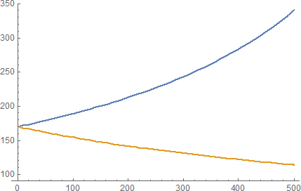

# 如何给AMM提供流动性

本文详细介绍了如何给AMM提供、提取流动性。

由于MCDEX Perpetual在链上都是[正向合约](https://mcdex.io/references/Perpetual#vanilla--inverse-contract)，所以这里的讨论都是以正向合约为例。注意: ETH-PERP在UI上显示为对应的反向合约。

## AMM交易模式

作为一个市场参与方，AMM的行为和传统做市商有相似之处：AMM给出交易价格（bid和ask），交易员通过和AMM交易做多/做空永续合约。目前MCDEX Perpetual AMM使用恒定乘积(constant product)的定价模型。这是一个在Uniswap中被充分验证的定价模型。

与传统做市商不同的是，任何人都可以通过给AMM增加存货的方式为AMM提供流动性、增加AMM的做市深度。我们称给AMM提供流动性的人为流动性提供者（LP，Liquidity Provider）。流动性提供者在多空不平衡时承受风险敞口，并获取交易手续费收益。

## AMM的保证金账户

和普通的交易员一样，AMM具有一个保证金账户。这个保证金账户内有保证金和多头头寸，且这个保证金账户的有效杠杆总是小于1，这也意味着AMM的保证金账户总是足额抵押的，用于不会被强制平仓。这个保证金账户里的保证金和多头头寸也称为AMM的存货。


我们用y表示AMM的多头头寸数量，则AMM的可用保证金(AMM's available margin)表示为x

```
x = Cash Balance - y * Entry Price
```
`Cash Balance`是流动性提供者存入的抵押物。`Entry Price`是AMM进入多头的平均价格。上述公式保证了AMM头寸始终保持完全抵押，即1倍保证金。头寸占用之外的保证金作为AMM的可用保证金。

为什么多头头寸可以保持完全抵押：以ETH为例，假设当前价格为p1，则一旦存入的抵押物达到p1，则相当于拥有1 ETH。如果此后价格变为p2，则PNL公式能保证抵押物自动变为p2，仍然相当于1 ETH。有时人们把这一现象称为合成资产（Synthetic assets）。因此在Uniswap公式中存入(p1) + (1ETH)，可以等价为存入(2 * p1)并获得(p1) + (1个多头头寸)。

值得注意的是，保证金账户按初始保证金率计算的可用保证金为：

```
Margin Balance = Cash Balance + PNL
PNL = (Mark Price - Entry Price) * y, 当y是多头头寸
Available Margin = Margin Balance - y * Mark Price * Initial Margin > x
```

也就是说，AMM的可用保证金(AMM's available margin)总是小于账户的可用保证金(account's available margin)。

x和y也即AMM的存货数量。定价模型要求交易前后`x · y = k`保持不变，则可以得出通过AMM交易的价格为：

```
买入Δy份合约的单价: P( Δy ) = x / ( y - Δy )
卖出Δy份合约的单价: P( Δy ) = x / ( y + Δy )
```

当交易员通过AMM做多时，AMM的多头头寸(`y`)下降，AMM的可用保证金(`x`)会上升，这个过程是消耗多头头寸存货的过程。

当交易员通过AMM做空时，AMM的多头头寸(`y`)上升，AMM的可用保证金(`x`)会下降，这个过程是消耗AMM可用保证金存货的过程。



更多关于AMM的定价公式的数学推导，可以参见[这里](https://mcdex.io/references/Perpetual#automated-market-maker)。

从上面的定价公式可以看出，AMM的定价只与AMM的存货数量`x`和`y`相关，当`k = x · y`的乘积越大时，定价公式给出的滑点越低，流动性也越好。所以给AMM增加流动性也就是增加`x`和`y`的值。


## 给AMM增加流动性

流动性提供者通过向AMM中添加存货、增大AMM存货数量`x`和`y`的值来提高AMM的流动性。以下过程在同一个合约调用中完成：

- 增加y：流通性提供者通过与AMM做空`Δy`份合约的方式，使得AMM的多头数量`y`增加`Δy`，交易价格为`Mid Price = x / y`
- 增加x：流动性提供者直接从自己的保证金账户向AMM转入抵押物，转入的数量为`2 ∙ Δy ∙ x / y`，相当于`x`部分增加了`Δy ∙ x / y`

转入AMM的抵押物分为相等的两部分，一部分用于AMM新增头寸占用的保证金，另一部分用于增加AMM的可用保证金。可以证明，增加流动性之后AMM中间价`Mid Price = x / y`保持不变。

在添加流动性后，提供者会按提供的存货大小获得AMM的份额代币。份额代币表示流动池中剩余存货的所有权。

在减少流动性时，流动性提供者可以通过销毁份额代币，按比例获得流动性池中的存货（包括头寸和保证金）。

添加和减少流动性时，新旧x、y、share的比值相同：

```
 x     y     share
--- = --- = -------
 x'    y'    share'
```

需要注意的是，由于向AMM添加流动性时会通过AMM做空，流动性提供者的头寸会下降。如果流动性提供者在操作前没有头寸，操作后流动性提供者的帐户中的头寸会变为空头。另一方面，由于需要从流动性提供者的保证金账户向AMM转入抵押物，如果提供者原来就有头寸，则由于保证金的减少，头寸的有效杠杆会上升。


`例1` 增加1份合约的流动性，如果Alice手上没有头寸

<table>
<thead>
<tr>
    <th></th>
    <th colspan="3">Alice的保证金账户</th>
    <th colspan="3">AMM的保证金账户</th>
</tr>
</thead>
<tbody>
<tr>
    <th></th>
    <th>头寸</th>
    <th>保证金余额</th>
    <th>AMM份额比例</th>
    <th>头寸(y)</th>
    <th>AMM可用保证金(x)</th>
    <th>中间价(x/y)</th>
</tr>
<tr>
    <td align="center">Add前</td>
    <td align="center">0</td>
    <td align="center">50</td>
    <td align="center">0/10</td>
    <td align="center">10</td>
    <td align="center">100</td>
    <td align="center">10</td>
</tr>
<tr>
    <td align="center">Add后</td>
    <td align="center">-1</td>
    <td align="center">30</td>
    <td align="center">1/11</td>
    <td align="center">11</td>
    <td align="center">110</td>
    <td align="center">10</td>
</tr>
</tbody>
</table>

Alice向AMM增加1份合约的流动性:

1. Alice与AMM以中间价10做空，则Alice的头寸变为-1，AMM的头寸变为11。
2. Alice向AMM转入10 * 1 * 2 = 20个抵押物代币。这20全部进入`Cash Balance`，其中10被新增的`y`占据，因此`x`增加10。

`例2` 增加1份合约的流动性，如果Alice手上已有1份多头

<table>
<thead>
<tr>
    <th></th>
    <th colspan="3">Alice的保证金账户</th>
    <th colspan="3">AMM的保证金账户</th>
</tr>
</thead>
<tbody>
<tr>
    <th></th>
    <th>头寸</th>
    <th>保证金余额</th>
    <th>AMM份额比例</th>
    <th>头寸(y)</th>
    <th>AMM可用保证金(x)</th>
    <th>中间价(x/y)</th>
</tr>
<tr>
    <td align="center">Add前</td>
    <td align="center">1</td>
    <td align="center">50</td>
    <td align="center">0/10</td>
    <td align="center">10</td>
    <td align="center">100</td>
    <td align="center">10</td>
</tr>
<tr>
    <td align="center">Add后</td>
    <td align="center">0</td>
    <td align="center">30</td>
    <td align="center">1/11</td>
    <td align="center">11</td>
    <td align="center">110</td>
    <td align="center">10</td>
</tr>
</tbody>
</table>

Alice向AMM增加1份合约的流动性:

1. Alice与AMM以中间价10做空，则Alice的头寸变为0，AMM的头寸变为11
2. ALice向AMM转入10 * 1 * 2 = 20个抵押物代币

这个例子里，Alice一开始就有1个多头头寸，经过添加操作，Alice没有头寸，相当于Alice将原有的多头头寸转移到了AMM里。


`例3` 增加1份合约的流动性，如果Alice手上已有1份空头

<table>
<thead>
<tr>
    <th></th>
    <th colspan="3">Alice的保证金账户</th>
    <th colspan="3">AMM的保证金账户</th>
</tr>
</thead>
<tbody>
<tr>
    <th></th>
    <th>头寸</th>
    <th>保证金余额</th>
    <th>AMM份额比例</th>
    <th>头寸(y)</th>
    <th>AMM可用保证金(x)</th>
    <th>中间价(x/y)</th>
</tr>
<tr>
    <td align="center">Add前</td>
    <td align="center">-1</td>
    <td align="center">50</td>
    <td align="center">0</td>
    <td align="center">10</td>
    <td align="center">100</td>
    <td align="center">10</td>
</tr>
<tr>
    <td align="center">Add后</td>
    <td align="center">-2</td>
    <td align="center">30</td>
    <td align="center">1/11</td>
    <td align="center">11</td>
    <td align="center">110</td>
    <td align="center">10</td>
</tr>
</tbody>
</table>

Alice向AMM增加1份合约的流动性:

1. Alice与AMM以中间价10做空，则Alice的头寸变为-2，AMM的头寸变为11
2. ALice向AMM转入10 * 1 * 2 = 20个抵押物代币

这个例子里，Alice一开始就有1个空头头寸，经过添加操作，Alice的空头头寸进一步增大。


## 风险敞口和收益

单纯向AMM提供流动性，并不增加流动性提供者的综合风险敞口。这是由于添加操作造成的空头头寸正好等于池子中的流动性提供者的多头份额。例如上述`例1`，当完成添加操作后，AMM的情况如下:

<table>
<thead>
<tr>
    <th></th>
    <th colspan="3">Alice的保证金账户</th>
    <th colspan="3">AMM的保证金账户</th>
    <th colspan="2">归属Alice的份额&ast;&ast;</th>
</tr>
</thead>
<tbody>
<tr>
    <th></th>
    <th>头寸</th>
    <th>保证金余额</th>
    <th>AMM份额比例</th>
    <th>头寸(y)</th>
    <th>AMM可用保证金(x)</th>
    <th>中间价(x/y)</th>
    <th>多头</th>
    <th>保证金</th>
</tr>
<tr>
    <td align="center">Add前</td>
    <td align="center">0</td>
    <td align="center">50</td>
    <td align="center">0</td>
    <td align="center">10</td>
    <td align="center">100</td>
    <td align="center">10</td>
    <td align="center">0</td>
    <td align="center">0</td>
</tr>
<tr>
    <td align="center">Add后</td>
    <td align="center">-1</td>
    <td align="center">30</td>
    <td align="center">1/11</td>
    <td align="center">11</td>
    <td align="center">110</td>
    <td align="center">10</td>
    <td align="center">1</td>
    <td align="center">20</td>
</tr>
</tbody>
</table>

&ast;&ast; AMM中归属Alice的多头 = y * Alice的份额比例<br>
&ast;&ast; AMM中归属Alice的保证金 = 2 * x * Alice的份额比例

Alice的综合余额情况：

|综合头寸| 综合保证金|
|:------:|:---------:|
| -1 + 1 = 0 |  30 + 20 = 50  |

综合余额与Alice最开始的保证金账户的情况的是一致的。这说明向AMM提供流动性只是将提供者的存货转移到了AMM的保证金账户里。

当其他交易员与AMM交易，会改变AMM的多头头寸数量y。进而改变AMM中归属Alice的多头数量。此时Alice的综合头寸不再为0，Alice具有风险敞口。

`例`：Bob与AMM做多1份合约

交易价格：`p = 110 / (11 - 1) = 11`，这里先忽略手续费

```
y' = y - 1 = 10
x' = x * y / y' = 110 * 11 / 10 = 121
```

交易完成后的AMM的情况如下：

<table>
<thead>
<tr>
    <th></th>
    <th colspan="3">Alice的保证金账户</th>
    <th colspan="3">AMM的保证金账户</th>
    <th colspan="2">归属Alice的份额</th>
</tr>
</thead>
<tbody>
<tr>
    <th></th>
    <th>头寸</th>
    <th>保证金余额</th>
    <th>AMM份额比例</th>
    <th>头寸(y)</th>
    <th>AMM可用保证金(x)</th>
    <th>中间价(x/y)</th>
    <th>多头</th>
    <th>保证金</th>
</tr>
<tr>
    <td align="center">Bob前</td>
    <td align="center">-1</td>
    <td align="center">30</td>
    <td align="center">1/11</td>
    <td align="center">11</td>
    <td align="center">110</td>
    <td align="center">10</td>
    <td align="center">11/11</td>
    <td align="center">220/11</td>
</tr>
<tr>
    <td align="center">Bob后</td>
    <td align="center">-1</td>
    <td align="center">30</td>
    <td align="center">1/11</td>
    <td align="center">10</td>
    <td align="center">121</td>
    <td align="center">12.1</td>
    <td align="center">10/11</td>
    <td align="center">242/11</td>
</tr>
</tbody>
</table>

此时Alice的综合头寸为`-1 + 10/11 = -0.0909`，不为0。因此Alice具有-0.0909份头寸的风险敞口，这个风险敞口直到另一个交易员与AMM做空1份合约后消失。

流动性提供者风险敞口的上限即为他添加到AMM中的存货的数量x与y。在实践中，流动性提供者可以监控链上AMM中的状态，当出现风险敞口时，提供者可以在其他交易所对风险敞口进行对冲，从而维持风险中性。

在实际运行中，当交易员与AMM交易时，需要额外支付0.075%的交易手续费，这其中的0.06%的手续费会进入AMM，增加AMM保证金余额，从而使得归属流动性提供者的保证金余额上升。在提供者提取AMM流动性时可以按份额比例获得该手续费。手续费即是对流动性提供者的激励。

如果流动性提供者对自己的风险敞口做完全对冲，则可以大大降低风险，获取相对稳定的手续费收益。另一方面，AMM的价格与场外价格之间也有价差，流动性提供者也可以在对冲风险的同时，对价差做套利操作。

最后，永续合约的头寸除了具有因价格波动造成的盈亏，也有因资金费率造成的盈亏，流动性提供者也需要根据具体的策略考虑资金费率的问题。总之，永续合约的流动性提供者的策略可以非常丰富。


## 提取AMM的流动性

流动性提供者可以随时将归属自己的池子中的份额提取出来。当提取流动性时，以下操作同时发生：
1. 池子将归属于提供者的保证金余额发送给流动性提供者。
2. 提供者通过池子做多，交易价格为中间价`x / y`，交易数量是池子中归属于提供者的头寸数量。

`例1` 接“给AMM增加流动性”例1，此时如果Alice提取所有流动性。此前Alice的份额是1 / 11。首先计算Alice消耗完份额需要交易多少头寸：

```
Amount = y * (ShareAmount / TotalSupply) = 1
Price = x / y = 10
```

相当于：
1、本次Alice以10的单价与AMM做多1份
2、Alice得到保证金：

```
Collateral = 2 * Price * Amount = 20
```

由于全局share从11下降到10，满足：

```
 x = 110     y = 11     share = 11
--------- = -------- = ------------ ∴ x' = 100, y' = 10
    x'         y'       share' = 10
```

<table>
<thead>
<tr>
    <th></th>
    <th colspan="3">Alice的保证金账户</th>
    <th colspan="3">AMM的保证金账户</th>
</tr>
</thead>
<tbody>
<tr>
    <th></th>
    <th>头寸</th>
    <th>保证金余额</th>
    <th>AMM份额比例</th>
    <th>头寸(y)</th>
    <th>AMM可用保证金(x)</th>
    <th>中间价(x/y)</th>
</tr>
<tr>
    <td align="center">Add前</td>
    <td align="center">0</td>
    <td align="center">50</td>
    <td align="center">0/10</td>
    <td align="center">10</td>
    <td align="center">100</td>
    <td align="center">10</td>
</tr>
<tr>
    <td align="center">Add后</td>
    <td align="center">-1</td>
    <td align="center">30</td>
    <td align="center">1/11</td>
    <td align="center">11</td>
    <td align="center">110</td>
    <td align="center">10</td>
</tr>
<tr>
    <td align="center">Remove后</td>
    <td align="center">0</td>
    <td align="center">50</td>
    <td align="center">0/10</td>
    <td align="center">10</td>
    <td align="center">100</td>
    <td align="center">10</td>
</tr>
</tbody>
</table>

此时相当于还原到Alice的最初状态。

`例2` 接“风险敞口和收益”中的例子，如果当Bob交易完成后，Alice提取所有流动性。此前Alice的份额是1 / 11。首先计算Alice消耗完份额需要交易多少头寸：

```
Amount = y * (ShareAmount / TotalSupply) = 0.909
Price = x / y = 12.1
```

相当于：
1、本次Alice以12.1的单价与AMM做多0.909份
```
PNL = (EntryPrice - ExitPrice) * Amount = (10 - 12.1) * 0.909 = -1.909. 这是空头头寸的PNL公式
```
2、Alice得到保证金：
```
RemovedCollateral = 2 * Price * Amount = 22
```

由于全局share从11下降到10，满足：

```
 x = 121     y = 10     share = 11
--------- = -------- = ------------ ∴ x' = 110, y' = 9.09
    x'         y'       share' = 10
```

<table>
<thead>
<tr>
    <th></th>
    <th colspan="3">Alice的保证金账户</th>
    <th colspan="3">AMM的保证金账户</th>
    <th colspan="2">归属Alice的份额</th>
</tr>
</thead>
<tbody>
<tr>
    <th></th>
    <th>头寸</th>
    <th>保证金余额</th>
    <th>AMM份额比例</th>
    <th>头寸(y)</th>
    <th>AMM可用保证金(x)</th>
    <th>中间价(x/y)</th>
    <th>多头</th>
    <th>保证金</th>
</tr>
<tr>
    <td align="center">Add前</td>
    <td align="center">0</td>
    <td align="center">50</td>
    <td align="center">0/10</td>
    <td align="center">10</td>
    <td align="center">100</td>
    <td align="center">10</td>
    <td align="center">0</td>
    <td align="center">0</td>
</tr>
<tr>
    <td align="center">Add后</td>
    <td align="center">-1</td>
    <td align="center">30</td>
    <td align="center">1/11</td>
    <td align="center">11</td>
    <td align="center">110</td>
    <td align="center">10</td>
    <td align="center">11/11</td>
    <td align="center">220/11</td>
</tr>
<tr>
    <td align="center">Bob后</td>
    <td align="center">-1</td>
    <td align="center">30</td>
    <td align="center">1/11</td>
    <td align="center">10</td>
    <td align="center">121</td>
    <td align="center">12.1</td>
    <td align="center">10/11</td>
    <td align="center">242/11</td>
</tr>
<tr>
    <td align="center">Remove后</td>
    <td align="center">-0.091</td>
    <td align="center">50.091</td>
    <td align="center">0/10</td>
    <td align="center">9.09</td>
    <td align="center">110</td>
    <td align="center">12.1</td>
    <td align="center">0</td>
    <td align="center">0</td>
</tr>
</tbody>
</table>

可以看到由于Bob的交易，造成Alice具有-0.091份合约的风险敞口，这个风险敞口在提取流动性后依旧存在，也就是说提取流动性不改变提供者的风险敞口。提供者可以在之后平仓头寸关闭风险敞口。
