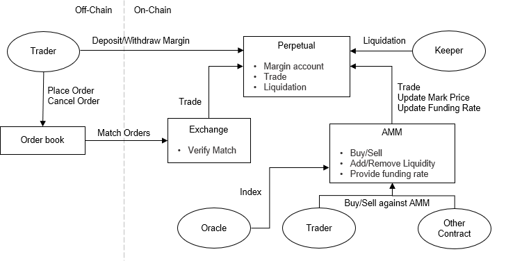

# Perpetual Architecture

The Mai Protocol V2 protocol is mainly composed of three parts: Perpetual, AMM and Exchange. The Perpetual contract stores data of margin accounts including collaterals and positions. The Exchange contract implements "match" interface for orderbook trading, similar to what Mai protocol V1 achieved. The AMM contract implements a Uniswap-like interface for user to directly interact with contract.



## Perpetual

Perpetual is the core of Mai Protocol V2 protocol. As mentioned above, it holds all assets owned by user, providing interfaces to manipulate balance and position. One Perpetual contract is exactly serving for one trading pair.

All calculations taking price as parameter read price from AMM contract. 

### Margin Account

A margin account contains a collateral account, a position account and its current broker, identified by user's ethereum address. Margin accounts are isolated between different perpetuals.

Every trader has to deposit before interacting with Exchange or AMM contract. Trades within system doesn't trigger real eth/erc20 transfer, but update the balance in their margin accounts.

#### Collateral Account

A collateral account holds all collateral deposited to the contract and its value can be affected by depositing and PNL (Profit-and-Loss) made from position trading.

Note that deposited collateral is converted to a internal decimals presentation (default: fix float number with decimals == 18) then added to balance field.

The storage structure is defined as:

```solidity
struct CollateralAccount {
	int256 balance;
	int256 appliedBalance;
	uint256 appliedHeight;
}
```

Balance is affected by depositing to contract and PNL of holding positions.

AppliedBalance and appliedHeight they together 

*For clarity, we will name the field balance in collateral account as cash balance to distinguish from erc20 token balance.*

#### PositionAccount

A position account stores information of position owned by user. Properties of position account will be recalculated on every trading. A position account is defined as:

```solidity
struct PositionAccount {
    Side side;
    uint256 size;
    uint256 entryValue;
    int256 entrySocialLoss;
    int256 entryFundingLoss;
}
```

#### Broker

Broker, specified by trader, is a kind of special user doing jobs of matching off-chain order for order owner. When matching different orders, all the orders should have the same broker. 

#### Governace

Governance maintains all parameters required for running a perpetual contract, including risk parameters, addresses, status and so on.

Governance configuations contains entries below:

```solidity
struct PerpGovernanceConfig {
    uint256 initialMarginRate;
    uint256 maintenanceMarginRate;
    uint256 liquidationPenaltyRate;
    uint256 penaltyFundRate;
    int256 takerDevFeeRate;
    int256 makerDevFeeRate;
    uint256 lotSize;
    uint256 tradingLotSize;
}
```
Check design of perpetual for their details.

### Exchange

Exchange contract focuses on matching off-chain order for traders. It matches orders between trader (known as maker and taker), or trader and AMM. 

Exchange will check price, properties and deadline of matching orders. Any unsatisfied condition will fail the whole transaction.

Since the signature mechanism, matching call currently requires a third caller as broker.

A typical order param is defined as:
```solidity
struct OrderParam {
    address trader;
    uint256 amount;
    uint256 price;
    bytes32 data;
    LibSignature.OrderSignature signature;
}

```

### AMM

AMM contract provides methods to add / remove liquidity and trading without orderbook. It can easily be called by other contract to build fresh application.

Trader could give proper price limit and deadline to get full controll of a trade. Instead of partial fill, if price is getting higher than price limit parameter, the transaction will fail.

### Global Config 

Global config is a simple contract only used to set block delay of withdrawal and broker update.

See _ for the design of time lock.
